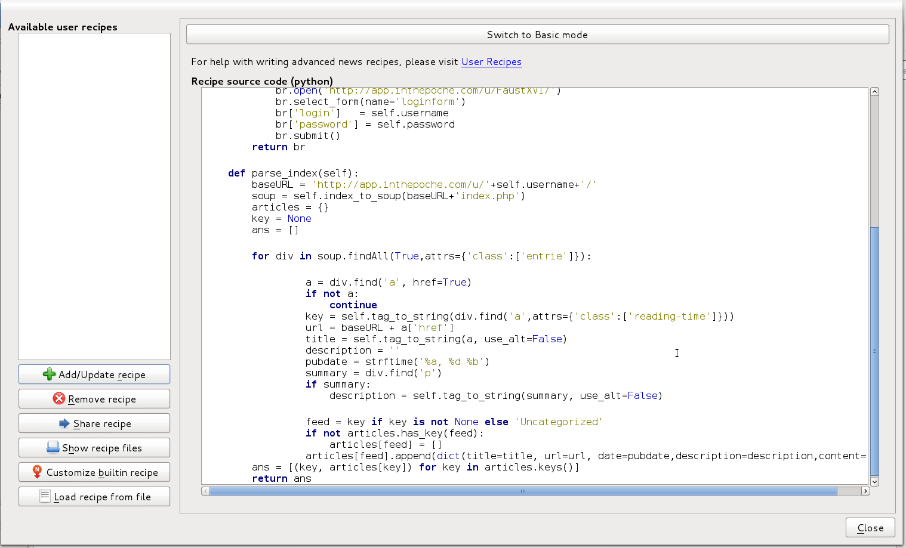
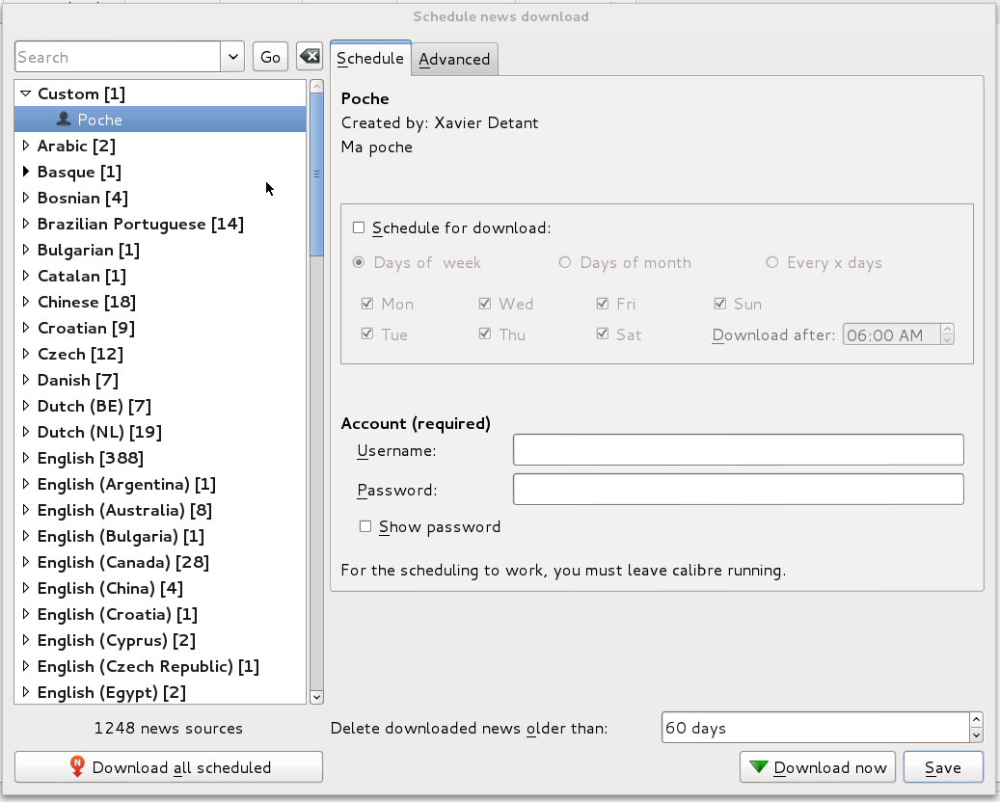

poche-to-calibre
================

== Goal

This project is a script for http://calibre-ebook.com/[calibre] in order to get http://www.inthepoche.com/[poche]
 bookmarks in epub format so you can read it later, off-line, on your e-reader.

== Prerequires

* a poche account on http://app.inthepoche.com/ or on a self-hosted server.
* calibre installed

== Installation

Download the _pocheToCalibre.py_ file.

Then, in calibre, click on the down arrow next to the _fetch news_ button, then on _Add a custom news source_.
In the appeared window you can configure your news source. Click on the _Smitch to advanced mode_ button and 
copy/paste the contents of the _pocheToCalibre.py_ file to the textarea. You should have something like that:

Additional step for self-hosted Poche: update the _appURL_ variable in script, e.g:

`http://example.com/poche/`

Then click on _Add/Update recipe_ and _Close_ the window (Calibre may say you'll lose any unsaved changes, but 
since you saved, this is not an issue).

Now click on the same arrow next to the _fetch news_ button and click on _Schedule news download_. In the new window,
select _Custom_ then _Poche_.

This is now working as any news stream:

* Schedule the downloads
* Fill-in your poche login and password
* Enjoy
